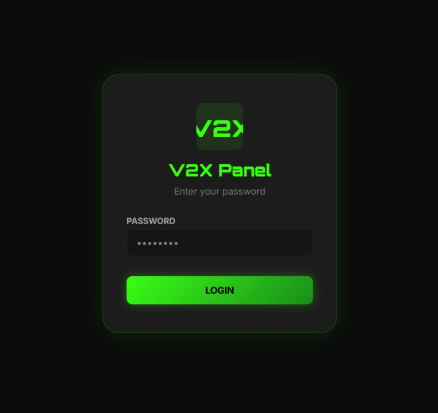

<div align="center">

# 🚀 پنل V2X (نسخه 1.0)

[](#)
[](#)
[](#)
[](#)

 <strong>Readme:</strong>
  <a href="README.md">English</a> |
  <a href="README-fa.md">فارسی</a>
</div>


> **یک پنل مدیریت اشتراک سبک و خودمیزبان برای VLESS روی WebSocket + TLS.**  
> کاملاً در یک فایل پایتون ساخته شده، با قدرت FastAPI و SQLite.

### 📸 نمای کلی پنل
<p align="center">
  
</p>

<p align="center">
  
</p>

</div>

---

## 📖 فهرست مطالب
- [✨ ویژگی‌های کلیدی](#ویژگی‌های-کلیدی)
- [🚀 شروع سریع و استقرار](#شروع-سریع-و-استقرار)
- [☁️ پلتفرم‌های استقرار](#پلتفرم‌های-استقرار)
- [📁 ساختار مخزن](#ساختار-مخزن)
- [💸 راهنمای پهنای باند و قیمت‌گذاری](#راهنمای-پهنای-باند-و-قیمت‌گذاری)
- [⚖️ سلب مسئولیت اکید](#سلب-مسئولیت-اکید)
- [🙏 قدردانی](#قدردانی)

---

## ✨ ویژگی‌های کلیدی

### 🔐 امنیت و دسترسی
- **احراز هویت قدرتمند:** نشست‌های مبتنی بر JWT با کوکی‌های امن و فقط HTTP.
- **مقابله با حملات جستجوی فراگیر:** محدودسازی نرخ برای ورود و تعامل با API اعمال شده است.
- **رمزهای عبور سختگیرانه:** خط‌مشی اجباری (حداقل ۸ کاراکتر، شامل حروف بزرگ، کوچک و اعداد).
- **ثبت حسابرسی:** تمام تلاش‌های ورود (موفق/ناموفق، IP، User-Agent) ثبت می‌شود.

### 📡 مدیریت کانال‌های ورودی (Inbounds)
- **چرخه عمر کامل:** ایجاد، ویرایش، فعال/غیرفعال و حذف ایمن تنظیمات VLESS.
- **کنترل دقیق:** محدودیت ترافیک هر کاربر (GB)، روزهای انقضا و حداکثر اتصالات هم‌زمان.
- **مسیریابی پیشرفته:** مسیر سفارشی، SNI، Host و اثرانگشت TLS برای هر کانال ورودی.
- **عملیات گروهی:** فعال/غیرفعال، بازنشانی یا حذف دسته‌ای تنظیمات.
- **هسته تغییرناپذیر:** کانال ورودی پیش‌فرض `SulgX` به طور سیستمی در برابر حذف تصادفی محافظت می‌شود.

### 📊 تحلیل‌های بلادرنگ
- **موتور سرعت زنده:** نمودارهای دانلود/آپلود بسیار دقیق با فیلترینگ تطبیقی نوسانات.
- **معیارهای پویا:** نوارهای ترافیک ۲۴ ساعته بلادرنگ (مبتنی بر منطقه زمانی) و نمودارهای دایره‌ای توزیع.
- **سلامت سیستم:** پایش لحظه‌ای CPU، حافظه و دیسک با جایگزین‌های `loadavg`.

### 🗺️ مدیریت IP تمیز و اسکنر ایمن
- **مدیریت IP:** افزودن، ویرایش و ورود دسته‌ای آدرس‌های IPv4/IPv6 که به صورت پویا به اشتراک‌ها متصل می‌شوند.
- **اسکنر ایمن:** اسکن پورت ۴۴۳ در ۲۴ ارائه‌دهنده ابری از پیش تعریف‌شده (Cloudflare، AWS، Azure و غیره).
- **ضد فروپاشی:** با محدود کردن به ۴۰۹۶ IP، از قفل شدن مرورگر در بازه‌های عظیم CIDR (مثلاً `/14`) جلوگیری می‌کند. به طور خودکار DNSهای عمومی (8.8.8.8) را مستثنی می‌کند.

### 🤖 ربات هوشمند تلگرام
- **دو زبانه (انگلیسی/فارسی):** قالب‌های کاملاً قابل ترجمه.
- **هشدارهای رویداد:** ورود به پنل، کاربران منقضی‌شده، خطاها و اخطارهای مصرف ۹۰٪ سهمیه.
- **پیش‌نمایش زنده:** نمایش لحظه‌ای قالب JSON در داشبورد.

---

## 🚀 شروع سریع و استقرار

> [!NOTE]
> V2X روی *هر* پلتفرمی که از برنامه‌های ASGI پایتون (Uvicorn/Gunicorn) و اتصالات استاندارد WebSocket پشتیبانی کند اجرا خواهد شد.

### 🍴 گام اول: فورک کردن مخزن
1. به مخزن اصلی پروژه در گیت‌هاب بروید: [V2X Panel](https://github.com/SulgX/V2X-Panel) 
2. روی دکمه **Fork** در بالا سمت راست صفحه کلیک کنید.
3. در پنجره‌ای که باز می‌شود، حساب کاربری خود را به عنوان مقصد انتخاب کنید و صبر کنید تا فرآیند فورک کامل شود.
4. حالا یک نسخه کامل از پروژه به حساب گیت‌هاب شما اضافه شده است که می‌توانید آن را به دلخواه تغییر دهید.

### ☁️ گام دوم: ثبت‌نام در پلتفرم ابری
یکی از سه پلتفرم پیشنهادی زیر را انتخاب کرده و ثبت‌نام کنید (می‌توانید مستقیماً با حساب گیت‌هاب وارد شوید و اجازه دسترسی بدهید):

- **[Render](https://render.com/)** ← پیشنهاد اصلی، بدون نیاز به کارت اعتباری
- **[Railway](https://railway.app/)** ← رابط کاربری مدرن، اعتبار اولیه رایگان
- **[Dockfly](https://dockfly.app/)** ← مینیمال و ساده

### 🚀 گام سوم: استقرار پروژه

<details>
<summary><b>🔹 استقرار روی Render</b></summary>

1. در داشبورد Render روی **New +** کلیک کنید و **Web Service** را انتخاب نمایید.
2. در بخش اتصال به گیت‌هاب، مخزن فورک‌شده خود (`V2X-Panel`) را پیدا کرده و **Connect** بزنید.
3. Render به‌طور خودکار فایل `render.yaml` را می‌خواند. نام سرویس و شاخه (branch) را تأیید کنید.
4. به پایین صفحه بروید و در بخش **Environment Variables** متغیرهای زیر را وارد کنید:
   - `ADMIN_PASSWORD`
   - `SECRET_KEY`
   - `DOMAIN`  
   *(مقادیر مطابق جدول متغیرهای محیطی در ادامه همین بخش تنظیم شوند.)*
5. روی **Create Web Service** کلیک کنید. پس از چند دقیقه آدرس عمومی سرویس شما ساخته می‌شود (مثلاً `v2x-test.onrender.com`).

</details>

<details>
<summary><b>🔹 استقرار روی Railway</b></summary>

1. در Railway روی **New Project** کلیک کنید و گزینه **Deploy from GitHub repo** را انتخاب نمایید.
2. مخزن فورک‌شده خود را انتخاب کنید.
3. Railway خودکار `Procfile` را تشخیص می‌دهد. برای افزودن متغیرهای محیطی، به تب **Variables** بروید و `ADMIN_PASSWORD`، `SECRET_KEY` و `DOMAIN` را با مقادیر مناسب اضافه کنید.
4. ساخت پروژه به‌طور خودکار آغاز می‌شود و یک دامنه عمومی دریافت می‌کنید.

🗝️ کاربران Railway: رنج آی‌پی Railway را به لیست IP تمیز اضافه کنید تا اسکن دقیق‌تری انجام شود.

</details>

<details>
<summary><b>🔹 استقرار روی Dockfly</b></summary>

1. در Dockfly یک **New Project** ایجاد کنید، منبع را **GitHub** بگذارید و مخزن فورک‌شده را انتخاب کنید.
2. در بخش Environment همان سه متغیر را وارد کنید.
3. اگر دستور شروع به‌طور خودکار اجرا نشد، به‌صورت دستی دستور زیر را وارد کنید:
   ```bash
   gunicorn -k uvicorn.workers.UvicornWorker main:app --bind 0.0.0.0:$PORT
   ```
4. روی **Deploy** کلیک کنید.

</details>

### 📌 متغیرهای محیطی
شما باید متغیرهای محیطی زیر را در داشبورد ارائه‌دهنده خود تنظیم کنید:

| متغیر | مقدار نمونه | توضیح |
| :--- | :--- | :--- |
| `ADMIN_PASSWORD` | `StrongPass!123` | برای دسترسی به پنل الزامی است. (حداقل ۸ کاراکتر، ترکیب حروف بزرگ و کوچک و اعداد). |
| `SECRET_KEY` | `random_long_string` | برای ایمن‌سازی کوکی‌های ورود JWT استفاده می‌شود. |
| `DOMAIN` | `v2x.up.railway.app` | دامنه عمومی شما. *برای تولید صحیح لینک‌ها به شدت توصیه می‌شود.* |
| `DB_PATH` | `/tmp/panel.db` | محل ذخیره پایگاه داده SQLite. در صورت استفاده از حجم‌های پایدار از `/data/panel.db` استفاده کنید. |

### 📌 دستور شروع
از این دستور دقیقاً در تمام پلتفرم‌ها استفاده کنید (در صورت نیاز دستی):
```bash
gunicorn -k uvicorn.workers.UvicornWorker main:app --bind 0.0.0.0:$PORT
```

---

## ☁️ پلتفرم‌های استقرار

V2X طوری ساخته شده که بدون نقص روی ارائه‌دهندگان ابری PaaS اجرا شود. بدون نیاز به Dockerfile یا راه‌اندازی پیچیده.

### 🏆 برترین ارائه‌دهندگان پیشنهادی

| پلتفرم | محدودیت رایگان | WebSocket | حالت خواب | نیاز به کارت اعتباری؟ | روش استقرار |
| :--- | :--- | :---: | :---: | :---: | :--- |
| **Render** | ۷۵۰ ساعت / ماه | ✅ | بله (با تأخیر) | خیر | خودکار از طریق `render.yaml` |
| **Railway** | ۵ دلار اعتبار اولیه | ✅ | خیر | خیر | خودکار از طریق `Procfile` |
| **Dockfly** | ۱ پروژه (۲۵۶ مگابایت) | ✅ | خیر | خیر | دستور شروع دستی |

<details>
<summary><b>🌍 برای مشاهده سایر پلتفرم‌های سازگار کلیک کنید</b></summary>

| پلتفرم | رایگان | WebSocket | حالت خواب | نیاز به کارت؟ |
| :--- | :--- | :---: | :---: | :---: |
| **Koyeb** | ۱ سرویس Eco | ✅ | خیر | خیر |
| **Fly.io** | حداکثر ۳ ماشین کوچک | ✅ | خیر | بله (تأیید هویت) |
| **Heroku** | Eco (۵ دلار/ماه) | ✅ | بله | بله |
| **DigitalOcean** | پایه ۵ دلار/ماه | ✅ | خیر | بله |
| **Oracle Cloud** | همیشه رایگان ARM | ✅ | خیر | بله (تأیید هویت) |

</details>

---

## 📁 ساختار مخزن

مخزن عمداً مینیمال نگه داشته شده است. هر آنچه برای تولید نیاز است گنجانده شده:

| فایل | نوع | هدف |
| :--- | :---: | :--- |
| `main.py` | **هسته** | قلب تپنده V2X. شامل بک‌اند FastAPI، تونل‌های WebSocket و فرانت‌اند HTML/JS توکار. |
| `requirements.txt` | **پیکربندی** | وابستگی‌های پایتون دقیقاً قفل‌شده برای پایداری ساخت. |
| `Procfile` | **استقرار** | دستورالعمل‌های استاندارد شروع به کار برای Heroku، Railway و Render. |
| `render.yaml` | **استقرار** | طرح زیرساخت به عنوان کد برای استقرار یک‌کلیکی فوری روی Render. |
| `v2x-config.toml` | **مستندات** | راهنمای مرجع شامل متغیرهای محیطی ضروری برای راه‌اندازی دستی. |
| `.gitignore` | **گیت** | با حذف لاگ‌ها، کش‌ها و فایل‌های `.db` محلی، مخزن را تمیز نگه می‌دارد. |

---

## 💸 راهنمای پهنای باند و قیمت‌گذاری

> [!IMPORTANT]
> **پنل V2X ۱۰۰٪ رایگان است.** با این حال، ارائه‌دهنده ابری شما بابت پهنای باند مصرفی کاربرانتان هزینه دریافت می‌کند.

| پلتفرم میزبانی | پهنای باند رایگان موجود | هزینه تقریبی هر گیگابایت اضافه |
| --- | --- | --- |
| **Render** | 5 گیگابایت / ماه | `۰.۱۰ دلار / گیگابایت` |
| **Railway** | پرداخت به میزان مصرف | `۰.۱۰ دلار / گیگابایت` |
| **Koyeb** | ۵ گیگابایت / ماه | `۰.۰۴` تا `۰.۱۰ دلار / گیگابایت` |
| **Fly.io** | بسته به منطقه متفاوت است | `۰.۰۲ دلار / گیگابایت` |
| **Oracle Cloud** | ۱۰ ترابایت / ماه | نرخ‌های استاندارد ابری |

*برای جلوگیری از هزینه‌های پیش‌بینی‌نشده، داشبورد صورتحساب ارائه‌دهنده ابری خود را زیر نظر داشته باشید. از محدودیت‌های ماهانه پنل برای کنترل مصرف استفاده کنید.*

---

## ⚖️ سلب مسئولیت اکید

> [!WARNING]
> **پیش از استقرار با دقت بخوانید**

* **رایگان و غیرتجاری:** این نرم‌افزار کاملاً رایگان ارائه می‌شود. **برای فروش نیست.**
* **VPN تجاری ممنوع:** از این پنل برای فروش اشتراک VPN استفاده نکنید. این پنل صرفاً برای اهداف شخصی، آموزشی و آزمایشی طراحی شده است.
* **سوءاستفاده از پلتفرم ممنوع:** با ایجاد حساب‌های متعدد با ایمیل‌های موقت، از سرویس‌های رایگان ارائه‌دهندگان ابری سوءاستفاده نکنید.
* **گزارش‌دهی:** اگر مشاهده کردید کسی دسترسی به این پنل خاص را می‌فروشد یا از زیرساخت‌ها سوءاستفاده می‌کند، لطفاً به ارائه‌دهنده میزبانی مربوطه گزارش دهید.
* **مسئولیت صفر:** توسعه‌دهنده مطلقاً **هیچ** مسئولیتی در قبال هرگونه خسارت، مازاد صورتحساب یا نقض شرایط سرویس ندارد. شما به تنهایی مسئول ترافیک خود هستید.

---

## 🙏 قدردانی

تشکر بی‌نهایت از پلتفرم‌ها و جوامعی که ابزارهای رایگان اینترنت را ممکن می‌سازند:

* **[Render](https://render.com/)**، **[Railway](https://railway.app/)** و **[Dockfly](https://dockfly.app/)** برای زیرساخت‌های فوق‌العاده مناسب توسعه‌دهندگان.
* جوامع متن‌باز پایتون و جاوااسکریپت:  
  - [FastAPI](https://fastapi.tiangolo.com/)  
  - [Chart.js](https://www.chartjs.org/)  
  - [aiosqlite](https://github.com/omnilib/aiosqlite)
* پروژه **[V2Fly](https://www.v2fly.org/)**.
